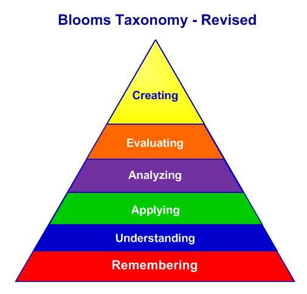

# Math - Where math is used

## Algorithms

- [How Reddit ranking algorithms work](https://medium.com/hacking-and-gonzo/how-reddit-ranking-algorithms-work-ef111e33d0d9)
- [Recounting the Rationals - a process for listing all rational numbers](https://www.math.upenn.edu/~wilf/website/recounting.pdf)

## Applications of Math to Real-World Problems

- [Real-world applications of mathematics, by arxiv subject area?](https://mathoverflow.net/questions/2556/real-world-applications-of-mathematics-by-arxiv-subject-area)

## Art

- [Rafael Araujo on mathematical illustrations of nature](https://www.orbmag.com/visual-arts/rafael-araujo-on-mathematical-illustrations-of-nature/)

## Astronomy

- [The Cosmic Distance Ladder - History of Measuring Distances to Heavenly Bodies](https://www.youtube.com/watch?v=7ne0GArfeMs&t=5m57s) - Terence Tao discusses how we have determined the distance to the moon, sun, planets, and so on, describing the mathematics and technology at each 'rung' of the ladder.

- [Why Do Planets Have Elliptical Orbits](https://www.youtube.com/watch?v=xdIjYBtnvZU) - 3Blue1Brown explains using math why orbits are elliptical. A paper explaining the same argument is [here](http://www.cems.uvm.edu/~tlakoba/AppliedUGMath/auxpaper_planets_HallHigson.pdf). 

## Biology

- [Ants Estimate Area Using Buffon's Needle](https://www.ncbi.nlm.nih.gov/pmc/articles/PMC1690598/pdf/10819145.pdf)
   - [Accuracy of Buffon's Needle](https://academic.oup.com/beheco/article/12/6/655/462588)
- [In defence of doing sums in genetics](https://www.nature.com/articles/s41437-019-0195-1) - *"There has been a long history of the use of mathematics in genetics, ranging from the use of statistics to analyse genetic data to genetic models of evolutionary processes. Contemporary research into the genomic basis of disease and complex traits exemplifies the importance of statistical methods in genetics. Some examples of the development and application of population genetic models are described, which are intended to highlight the utility of such models for understanding variation and evolution in natural populations. The effects of selection on variability at sites linked to the targets of selection illustrate how fruitful interactions between theory and data can be."*
- [Statistical mechanics for natural flocks of birds - modelling flock behaviour](http://www.pnas.org/content/pnas/109/13/4786.full.pdf) From the article: *"Flocking is a typical example of emergent collective behavior, where interactions between individuals produce collective patterns on the large scale. Here we show how a quantitative microscopic theory for directional ordering in a flock can be derived directly from field data. We construct the minimally structured (maximum entropy) model consistent with experimental correlations in large flocks of starlings."*
- [Math Sheds Light on How Living Cells 'Think'](#null)
   - [News article](https://phys.org/news/2018-05-math-cells.html)
   - [Journal source](https://www.nature.com/articles/s41467-018-04151-6)
- [The Chemical Basis of Morphogenesis - A.M.Turing (1952)](http://www.dna.caltech.edu/courses/cs191/paperscs191/turing.pdf)
- [Seashells: The plainness and beauty of their mathematical description - Jorge Picado](http://www.mat.uc.pt/~picado/conchas/eng/article.pdf)

## Biomimicry

- [Geckos - Researchers built a gecko-bot to study how geckos glide and crash land](https://arstechnica.com/science/2021/12/researchers-built-a-gecko-bot-to-study-how-geckos-glide-and-crash-land/)
- [Short video explaining biomimicry](https://www.youtube.com/watch?v=iMtXqTmfta0&)
- [Sea Urchin Spines Inspire Elastic Concrete](https://github.com/rusac/math/blob/master/Mesocrystalline%20calcium%20silicate%20hydrate%20-%20elastic%20concrete%20(2017)e1701216.full.pdf)
- [Slime Mold Grows Network Just Like Tokyo Rail System](https://www.wired.com/2010/01/slime-mold-grows-network-just-like-tokyo-rail-system/)
- [Soldier Crab Logic Gate](https://arxiv.org/pdf/1204.1749.pdf) Abstract: *Soldier crabs Mictyris guinotae exhibit pronounced swarming behaviour. The  swarms  of  the  crabs  tolerant  of  perturbations. In  computer models  and  laboratory  experiments  we  demonstrate  that  swarms  of  soldier crabs can implement logical gates when placed in a geometrically constrained environment.*
- [Water filter inspired by Alan Turing passes first test: Membrane's structure predicted in mathematician's lone biology paper](https://www.nature.com/articles/d41586-018-05055-7)

## Business

- [Probability Models for Customer-BaseAnalysis](http://www.brucehardie.com/talks/ho_cba_tut_art_13.pdf) Paraphrased from the pdf: *"Faced with a customer transaction database, we may wish to determine: which customers are most likely to be active in the future; the level of transactions we could expect in future periods from those on the customer list, both individually and collectively; and–individual customer lifetime value."*

## Coffee

- [Systematically Improving Espresso: Insights from Mathematical Modeling and Experiment](https://www.cell.com/matter/fulltext/S2590-2385(19)30410-2?_returnURL=https%3A%2F%2Flinkinghub.elsevier.com%2Fretrieve%2Fpii%2FS2590238519304102%3Fshowall%3Dtrue)

## Complex Numbers

- [Quaternions](https://en.wikipedia.org/wiki/Quaternion)

Quaternions are used for 'calculations involving three-dimensional rotations', such as in aeronautics and robotics. 

## Computing

- [A Mathematical Theory of Communication - C.E.Shannon](Shannon-MathematicalTheoryofCommunication.pdf)
- [The Byzantine Generals Problem](https://people.eecs.berkeley.edu/~luca/cs174/byzantine.pdf)
- [The Halting Problem](http://www.cgl.uwaterloo.ca/csk/halt/)
- [Computational capacity of the universe](https://arxiv.org/pdf/quant-ph/0110141.pdf)
- [The Maniac 1](https://en.wikipedia.org/wiki/MANIAC_I)*"The MANIAC I (Mathematical Analyzer Numerical Integrator and Automatic Computer Model I) was an early computer built under the direction of Nicholas Metropolis at the Los Alamos Scientific Laboratory."*
- [The Maniac 1 - computer manual](http://www.bitsavers.org/pdf/lanl/LA-1725_The_MANIAC_Jul54.pdf)

## Cryptography

- [Short discussion about the history of cryptography](https://boolesrings.org/mpawliuk/2013/03/24/kangaroo-contest-2013-talk-about-cryptography/)
- [A Masked White-box Cryptographic Implementation for Protecting against Differential Computation Analysis - Seungkwang Lee (2017)](https://eprint.iacr.org/2017/267.pdf)
- [Repository of various public white-box cryptographic implementations and their practical attacks](https://github.com/SideChannelMarvels/Deadpool)

## Digital Signal Processing - Audio, Visual, and Other

- [Audio-Visual Speech Separation - Separating Audio Tracks From Video](https://ai.googleblog.com/2018/04/looking-to-listen-audio-visual-speech.html) *"People are remarkably good at focusing their attention on a particular person in a noisy environment, mentally “muting” all other voices and sounds. Known as the cocktail party effect, this capability comes natural to us humans. However, automatic speech separation — separating an audio signal into its individual speech sources — while a well-studied problem, remains a significant challenge for computers."* The paper can be found [here](https://arxiv.org/pdf/1804.03619.pdf).

- [Digital Signal Processing](http://www.dspguide.com/pdfbook.htm) To quote the author of the guide in the link above: *"Digital Signal Processing is one of the most powerful technologies that will shape science and engineering in the twenty-first century. Revolutionary changes have already been made in a broad range of fields: communications, medical imaging, radar & sonar, high fidelity music reproduction, and oil prospecting, to name just a few. Each of these areas has developed a deep DSP technology, with its own algorithms, mathematics, and specialized techniques."*

## Discrimination

- [Jewish Problems](https://arxiv.org/abs/1110.1556) From the abstract:
*"This is a special collection of problems that were given to select applicants during oral entrance exams to the math department of Moscow State University. These problems were designed to prevent Jews and other undesirables from getting a passing grade. Among problems that were used by the department to blackball unwanted candidate students, these problems are distinguished by having a simple solution that is difficult to find. Using problems with a simple solution protected the administration from extra complaints and appeals. This collection therefore has mathematical as well as historical value."* The author's website is here: http://www.tanyakhovanova.com/Coffins/coffinsmain.html

## Elections

- [Arrow's Theorem (or: How I Learned to Stop Worrying and Love Dictatorships)](https://almostsurelymath.home.blog/2020/02/09/arrows-theorem-or-how-i-learned-to-stop-worrying-and-love-dictatorships/)

Gerrymandering:
- [You can’t tell a gerrymandered district by its shape](https://news.osu.edu/you-cant-tell-a-gerrymandered-district-by-its-shape/)
- [An impossibility theorem for gerrymandering](https://dustingmixon.wordpress.com/2017/10/11/an-impossibility-theorem-for-gerrymandering/)

## Elevator Logistics

- [Elevator Saga The elevator programming game](https://play.elevatorsaga.com/)

## Games

- [Gamedev Tutorial: Dot Product, Rulers, And Bouncing Balls](https://allenchou.net/2020/01/dot-product-projection-reflection/)
- [The Mathematical Beauty of the Game SET](https://aperiodical.com/2018/07/the-mathematical-beauty-of-the-game-set/)
- [Demo-Man - Interactive gamedev tutorials](https://demoman.net/)*Trigonometry and vector mathematics in basic videogame development.*
- [Math for Game Programmers: Interaction With 3D Geometry](https://www.youtube.com/watch?v=GpsKrAipXm8)*Vector maths for videogames.*
- [Pysically Based Rendering - From Theory to Implementation](http://www.pbr-book.org/3ed-2018/contents.html)
- [Ray Tracing Essentials Part 1: Basics of Ray Tracing](https://news.developer.nvidia.com/ray-tracing-essentials-part-1-basics-of-ray-tracing/) 
- [Rubik's Cube - God's Number is 20](https://www.cube20.org/)
- [Rubik's Cube - UWaterloo pdf](https://www.math.uwaterloo.ca/~malacroi/slides/CubeTalk.pdf)
- [The Mathematics of the Rubik’s CubeIntroduction to Group Theory and Permutation Puzzles](https://web.mit.edu/sp.268/www/rubik.pdf)
- [Group Theory and the Rubik’s Cube - Janet Chen](http://www.math.harvard.edu/~jjchen/docs/Group%20Theory%20and%20the%20Rubik%27s%20Cube.pdf)
- [Three Statistical Tests Every Game Developer Should Know](https://www.youtube.com/watch?v=fl9V0U2SGeI)
- [Unreal Engine Optimized Post-Effects](https://adriancourreges.com/blog/2018/12/02/ue4-optimized-post-effects/)

## Infinity

- [Infinity and the Mind](http://www.rudyrucker.com/infinityandthemind/)

## Knots

- [Knots - Mathematicians are devising new techniques to better predict how to tie strong knots that are useful in climbing and sailing](https://www.scientificamerican.com/article/color-changing-fibers-unravel-a-knotty-mystery/)

## Literature

- [Cadaeic Cadenza - Writing poetry where each word-length denotes successive digits of pi](http://www.cadaeic.net/cadenza.htm)

## Maps

- [The topologist’s world map](https://tafc.space/qna/the-topologists-world-map/)

## Movies - Special Effects

- [3D Modelling Techniques Worthy of an Oscar](https://news.artsci.utoronto.ca/all-news/our-community/oscar-goes-u-t-educated-graphics-whiz/) - *"Some of his early research focused on how to realistically depict “gaseous natural phenomena” like curling wisps of smoke, mist over a field or car exhaust while they react to a “turbulent field” like wind. His graphics, like a steaming cup of coffee, look simple in hindsight, but were anything but in the early 1990s.... His work on fast fluid flow computation in particular introduced techniques that were a breakthrough in visual fluid simulation and has deeply influenced dozens of researchers over the past 20 years."*

- [Pixar - Online library](http://graphics.pixar.com/library/) - *Has many technical memos on CGI work.*

## Networks - Social and Political Connections

- [Networks, Crowds, and Markets: Reasoning about a Highly Connected World (David Easley and Jon Kleinberg, CUP, 2010.](https://www.cs.cornell.edu/home/kleinber/networks-book/networks-book-ch05.pdf) - The author writes: *"Here we describe a rich part of social network theory that involves taking a network and annotating its links (i.e., its edges) with positive and negative signs.  Positive links represent friendship while negative links represent antagonism, and an important problem in the study of social networks is to understand the tension between these two forces.."*
The complete preprint is available on-line at http://www.cs.cornell.edu/home/kleinber/networks-book/.

- [The Polarization of Society: Even Scientists Become Tribal](https://www.acsh.org/news/2018/11/28/polarization-society-even-scientists-become-tribal-13628) - *The authors, Cailin O'Connor and James Owen Weatherall, argue that polarization is the natural outcome when groups of people disagree. In fact, they document a major example of polarization within the scientific community itself.*

- [The Evolution of Trust](https://ncase.me/trust/)

## Philosophy

- [The 'Square of Opposition', a collection of logical relationships traditionally embodied in a square diagram.](https://plato.stanford.edu/entries/square/)

## Programming

- [Is the room open? Programming problem](https://www.noudaldenhoven.nl/wordpress/?p=288)

## Physics

- [A Collector of Math and Physics Surprises - Tadashi Tokieda](https://www.quantamagazine.org/tadashi-tokieda-collects-math-and-physics-surprises-20181127/)
- [Gears](https://ciechanow.ski/)

## Proofs

- [Book of Proof - Hammack](http://www.people.vcu.edu/%7Erhammack/BookOfProof/index.html)
- [How to Read and Understand Proofs](https://boolesrings.org/mpawliuk/2014/03/31/how-to-read-understand-and-study-proofs/)

## Science

- [What to do when you don’t trust your data anymore](https://laskowskilab.faculty.ucdavis.edu/2020/01/29/retractions/)

## Sound and Sine Waves

- [Encoding data in dubstep drops](https://blog.benjojo.co.uk/post/encoding-data-into-dubstep-drops)

## Statistics, data management, probability

- [Game Track - Covering the gaming market](https://www.ipsos.com/ipsos-mori/en-uk/gametrack)

- [German Tank Problem](https://mathsection.com/german-tank-problem/)

- [Heart doctors 'held back stent death data'](https://www.bbc.com/news/health-51539112)

- [Mathematics of Machine Translation - Algorithms for translating languages](https://github.com/rusac/math/blob/master/Mathematics%20of%20Machine%20Translation%20-%20Parameter%20Estimation%20-%20Mercer%20(1993).pdf)

- [Multi-Armed Bandit(MAB) – A/B Testing Sans Regret](https://vwo.com/blog/multi-armed-bandit-algorithm/)

- [Private traits and attributes are predictable from Facebook 'likes'](https://github.com/rusac/math/blob/master/Private%20traits%20and%20attributes%20are%20predictable%20from%20digital%20records%20of%20facebook%20likes%20-%20Kosinski(2013).pdf)

- [Variance - Advancing the Science of Risk (Journal)](https://www.variancejournal.org/) - *"Variance is a peer-reviewed journal published by the Casualty Actuarial Society to disseminate work of interest to casualty actuaries worldwide. The focus of Variance is original practical and theoretical research in casualty actuarial science."*

## Traffic

- [Vehicle Routing Problem](http://neo.lcc.uma.es/vrp/vehicle-routing-problem/)
- [Boarding Airplanes - What is the fastest way?](https://www.cgpgrey.com/blog/whats-the-fastest-way-to-board-an-airplane)
- [The case for almost never turning left while driving - UPS](https://www.washingtonpost.com/news/innovations/wp/2014/04/09/the-case-for-almost-never-turning-left-while-driving/)
- [Why UPS drivers don’t turn left and you probably shouldn’t either](https://theconversation.com/why-ups-drivers-dont-turn-left-and-you-probably-shouldnt-either-71432)

## Trigonometry

- [Apollo 11 implementation of trigonometric functions](https://fermatslibrary.com/s/apollo-11-implementation-of-trigonometric-functions#email-newsletter) *"This code was submitted by Margaret H. Hamilton (Programming Leader
Apollo Guidance and Navigation) in March 1969 and was used to evaluate trigonometric functions essential for navigation on both the Command Module and Lunar Lander that first landed humans on the Moon."*

## Vectors

- [Game Design - Programming Track Visuals in SNES game F-Zero](http://meatfighter.com/fzerotruehorizons/)

# Where not using math, or using math poorly, can cause problems

- [Spain builds submarine 70 tons too heavy after putting a decimal in the wrong place](https://o.canada.com/news/spain-builds-submarine-70-tons-too-heavy)
- [Nov. 10, 1999: Metric Math Mistake Muffed Mars Meteorology Mission](https://www.wired.com/2010/11/1110mars-climate-observer-report/)
- [Upside-Down Sensors Toppled Russian Rocket](https://www.wired.com/2010/11/1110mars-climate-observer-report/)
- [What Happens When Maths Goes Wrong? with Matt Parker](https://www.youtube.com/watch?v=6JwEYamjXpA) - *"You can find any pattern you want to any level of precision you want as long as you're prepared to ignore enough data."*
- [Beyond Reasonable Doubt - The Story of Sally Clark (Bayes' Theorem used in court case)](https://plus.maths.org/content/beyond-reasonable-doubt)
- [Honda Needs a Tune-Up](http://davidsd.org/2008/12/honda-needs-a-tune-up/) *- "A musical road that Honda built in Lancaster, CA.. A team of engineers carved some grooves into a highway that were carefully spaced to play the William Tell Overture as you drive over them at a constant speed."*

# Recreational Mathematics

## Puzzles

- [Alex Bellos' Monday Puzzle - The Guardian](https://www.theguardian.com/science/series/alex-bellos-monday-puzzle)
- [Project Euler](http://projecteuler.net)

## Math-related Games

- [A Slower Speed of Light ](http://gamelab.mit.edu/games/a-slower-speed-of-light/)
- [ChemWorks - browser game](https://nonotcar.itch.io/chemworks)
- [Euclidea](http://euclidea.xyz)
- [Factorio](https://www.factorio.com/)
- [HyperRogue](http://roguetemple.com/z/hyper/)
- [Jelly no Puzzle](https://avorobey.github.io/jelly/?1)
- [Kerbal Space Program](#null)
- [Manufactoria](http://pleasingfungus.com/Manufactoria/)
- [Miegakure](http://miegakure.com)
- [Minecraft](#null)
- [Portal](#null)
- [Spacechem](http://www.zachtronics.com/spacechem/)
- [Talos Principle](#null)
- [Natural Number Game](https://www.ma.imperial.ac.uk/~buzzard/xena/natural_number_game/)
- [other suggestions-redditthread](https://www.reddit.com/r/math/comments/pu37my/what_mathy_games_are_interesting_and_fun_to_play/)

## Making Drawings

- Escher
- Dragon Curve
- Golden Spiral
- Appolonian Gasket, Serpinski Triangle, etc
- [Barnsley Fern](https://en.wikipedia.org/wiki/Barnsley_fern)
- [One-line drawings using CLIPasso](https://clipasso.github.io/clipasso/)
   - [install inside docker environment](https://github.com/yael-vinker/CLIPasso)
   - [another example using imagemagick and autotrace](https://schollz.com/blog/one-line/)
   - temporary: (install docker to drive with lots of space to begin with)
   - sudo docker system df (-v to view more info about size taken)
   - sudo docker prune
   - sudo docker system prune
   - https://www.guguweb.com/2019/02/07/how-to-move-docker-data-directory-to-another-location-on-ubuntu/
   - docker pull yaelvinker/clipasso_docker:latest
   - docker ps (to list active docker containers)
   - docker cp host_source_path container:destination_path 
   - docker cp container:source_path host_destination_path

# Math Resources

## Biographies

- [An Evening with Leonhard Euler](https://www.youtube.com/watch?v=h-DV26x6n_Q)
- [Fermat](#null)
   - [Andrew Wiles’ historical Fermat's Last Theorem talk at the 1998 ICM](https://www.youtube.com/watch?v=EDMJElLpm1U)
   - [Fermat's Last Theorem - The Theorem and Its Proof: An Exploration of Issues and Ideas [1993]](https://www.youtube.com/watch?v=6ymTZEeTjI8)
- [J. von Neumann](https://qualiacomputing.com/2018/06/21/john-von-neumann/)

## Blogs and Magazines

- [Eureka magazine](https://www.archim.org.uk/eureka/archive/)
- [Tanya Khovanova blog](https://blog.tanyakhovanova.com/)
- [How to create a better research poster](https://www.youtube.com/watch?v=SYk29tnxASs)

## Books 
http://linear.ups.edu/curriculum.html

- [Home page for the book, Bayesian Data Analysis, by Gelman, Carlin, Stern, Dunson, Vehtari, and Rubin. ](http://www.stat.columbia.edu/~gelman/book/)
- [Open Logic Project - "*open-source, collaborative textbook of logic and formal methods, starting at an intermediate level, aimed at a non-mathematical audience.*"](http://openlogicproject.org/)
- [Living Proof: Stories of Resilience Along the Mathematical Journey](http://www.ams.org/about-us/LivingProof.pdf)
- [Various books for all levels - latex formatted](https://pretextbook.org/catalog.html)

## Courses

- [MIT Open Courseware](https://ocw.mit.edu/index.htm)
- [OpenStax](https://openstax.org/) - *Free textbooks for Algebra, Calculus, Statistics for highschool and undergraduate studies.*
- [Introduction to probability, statistics, and random processes](https://www.probabilitycourse.com/)
- [Statistics 110: Probability - Blitzstein](https://projects.iq.harvard.edu/stat110/home)

## High-School Resources

- [Book of Proof (Hammack)](https://www.people.vcu.edu/~rhammack/BookOfProof/)
- [Discrete Mathematics: An Open Introduction (Levin)](http://discrete.openmathbooks.org/pdfs/dmoi-tablet.pdf)
- [Calculus: Single Variable by Professor Robert Ghrist - video playlist](https://www.youtube.com/playlist?list=PLKc2XOQp0dMwj9zAXD5LlWpriIXIrGaNb)
- [University of Waterloo Courseware for MHF and MCV](https://courseware.cemc.uwaterloo.ca/)
- [University of Cambridge - STEP Math Exam Preparation](https://stepdatabase.maths.org/)
- [University of Cambridge - STEP Math Exam Past Papers](http://www.admissionstesting.org/for-test-takers/step/preparing-for-step/)
- [University of Cambridge - STEP Support Program](https://maths.org/step/)
- [NRICH Advanced Problem Solving Resources](https://nrich.maths.org/11472)
- [Resources for Teaching A-Level Maths](https://undergroundmathematics.org/)
- [University of Oxford - Maths Admissions Test](https://www.maths.ox.ac.uk/study-here/undergraduate-study/maths-admissions-test)
- [Math Competitions Compilation](http://mathcompetitions.info/)
- [Order of Operations - the  48/2(9+3)  question](https://math.berkeley.edu/~gbergman/misc/numbers/ord_ops.html)
- [NZQA - New Zealand Qualifications Authority - Calculus Exams](https://www.nzqa.govt.nz/qualifications-standards/awards/new-zealand-scholarship/scholarship-subjects/scholarship-mathematics-with-calculus/)
- [MS Croggs Advent Calendar](https://www.mscroggs.co.uk/)
- [Advent of Code - programming challenge](https://adventofcode.com/)
- [Chalkdust Magazine](https://chalkdustmagazine.com/)

## Calculus Intro Resources
Vi Hart:
https://www.youtube.com/watch?v=pI62ANEGK6Q
https://www.youtube.com/watch?v=3zQsYJi5pFE

Grant Sanderson:
https://www.3blue1brown.com/topics/calculus

Steve Strogatz (“explain to a high school student”):
https://www.stevenstrogatz.com/books/infinite-powers

“Explain like you are a first-year taking an intro course”:
http://www.science.smith.edu/%7Ecallahan/intromine.html
http://www.science.smith.edu/%7Ecallahan/cic/ch1.pdf
http://www.science.smith.edu/%7Ecallahan/cic/ch2.pdf
http://www.science.smith.edu/%7Ecallahan/cic/ch3.pdf
http://www.science.smith.edu/%7Ecallahan/cic/ch4.pdf

## LaTeX - Writing Papers in Mathematics and Using LaTeX

### Online Live Latex
- [Online LateX Editor - Overleaf](www.overleaf.com)
- [MathB.in - Share mathematics on the web](http://mathb.in/)
- [LateX Base - Online Editor and Compiler](https://latexbase.com/)

### Latex installs for offline
- [TeXstudio - Latex Editor (all platforms)](https://www.texstudio.org/)

### Tables in LaTeX
- [Tables Generator](http://www.tablesgenerator.com/)
- [Tables Editor](https://www.latex-tables.com/)
- [Controlling Table Columns in Latex](https://texblog.org/2019/06/03/control-the-width-of-table-columns-tabular-in-latex/)

### Presentation formats: beamer;
- [Powerdot - a presentation class for latex](https://www.ctan.org/pkg/powerdot)
- [Alternatives to beamer](https://tex.stackexchange.com/questions/27267/which-alternatives-to-the-beamer-class-exist)

### Fonts in Latex
- [Font catalogue](https://tug.org/FontCatalogue/alphfonts.html)
- [Changing font size](https://latex-tutorial.com/changing-font-size/)

### Graphs in LaTeX
- [Latex to SVG - useful for exporting images with transparent backgrounds](https://viereck.ch/latex-to-svg/)
- Cartesian grid how-to: https://tex.stackexchange.com/questions/222882/drawing-minimal-xy-axis
   - https://tex.stackexchange.com/questions/142120/positioning-of-pgfplot-axis-labels
   - https://tex.stackexchange.com/questions/369929/label-pgfplot-axes-tikz
- [Using pgfplots to make economic graphs in LaTeX](https://towardsdatascience.com/using-pgfplots-to-make-economic-graphs-in-latex-bcdc8e27c0eb)
- [TikZ Graph Examples](http://www.texample.net/tikz/examples/tag/3d/)
- [PgfPlots.net - making graphs with LaTeX](http://pgfplots.net/tikz/examples/all/)
- [PgfPlots Gallery - list of different graphs using pgfplots](http://pgfplots.sourceforge.net/gallery.html)
- [Graph examples - all types](https://awesomeopensource.com/project/walmes/Tikz)
- [Commutative Diagrams in TikZ](http://jmilne.org/not/Mtikz.pdf)
- [TikZ GUI editor](http://www.tikzedt.org/)
- [Minimal TikZ - pdf guide](https://cremeronline.com/LaTeX/minimaltikz.pdf)
- [gnuplot homepage](http://www.gnuplot.info/)
- [Demos for gnuplot version 5.2](http://gnuplot.sourceforge.net/demo/)
- [Xfig](http://www.xfig.org/)
- [matplotlib - Python graphing tool](https://matplotlib.org/)
- [Draw.io](https://www.draw.io/) *For scatterplots, flowcharts, etc.*
- [MetaPost](https://www.tug.org/metapost.html) *The MetaPost system implements a picture-drawing language that...outputs vector graphic files instead of run-length-encoded bitmaps; output formats available are PostScript and SVG.*
- [Inkscape - draw program](https://inkscape.org/)
- [SageMath Open Source Graphing Program](https://www.sagemath.org/)
- [Asymptote - Vector Graphics Program](https://asymptote.sourceforge.io/)
- [PSTricks - Gallery](http://tug.org/PSTricks/main.cgi?file=Examples/Gallery/Gallery)
- [TeXample.net](http://www.texample.net/)
- [Ipe extensible drawing editor](http://ipe.otfried.org/)
- [Free-hand graphing - can do with stylus and convert to latex](https://homepages.inf.ed.ac.uk/cheunen/freetikz/freetikz.html)
- [Clear basic steps to starting a cartesian graph](https://latexdraw.com/plot-tikz-easy-steps/)
- [Grid-based diagram maker](https://app.diagrams.net/)
- [Detextify - draw a shape and get the LaTeX command for it](http://detexify.kirelabs.org/classify.html?)

### Other
- [Creating LaTeX commands](https://artofproblemsolving.com/wiki/index.php?title=LaTeX:Commands)
- [The Not-So Short Introduction to Latex](https://tobi.oetiker.ch/lshort/lshort.pdf)
- [Typing Exams in LateX](https://www.sharelatex.com/learn/latex/Typing_exams_in_LaTeX#grading_table)
- [TeX Users Group](http://www.tug.org/)
- [The Comprehensive TeX Archive Network](http://www.ctan.org/)
- [Art of Problem Solving Tutorial](http://www.artofproblemsolving.com/LaTeX/AoPS_L_About.php)
- [TexPaste](http://www.texpaste.com/)
- [WriteLaTeX WYSIWYG](https://www.writelatex.com/)
- [Math Symbols and Equations in Latex](http://crab.rutgers.edu/~karel/latex/class4/class4.html)
- [The Comprehensive LaTeX Symbol List](http://ftp.math.purdue.edu/mirrors/ctan.org/info/symbols/comprehensive/symbols-a4.pdf)
    *338 page PDF with over 500 tables; when they say comprehensive, they mean comprehensive.*

## Math In Literature, or somewhat tangentially related

- [The Library of Babel - Borges]()
- [The Aleph - Borges]()
- [The Labyrinth - Borges]()
- [The Last Question - Asimov]()
- [The Nine Billion Names of God - Clarke]()
- [Mathematical Fiction - Chronological list](http://kasmana.people.cofc.edu/MATHFICT/mfbrowse-pubyear.php)

## Problems

- [33 - Sum of cubes](https://www.reddit.com/r/math/comments/ayzy6s/33886612897528752838778405442862239327361114688070/)
- [42 is the new 33](https://www.reddit.com/r/math/comments/b0b67v/42_is_the_new_33/)

## Digital teaching presentation tools / resources:

- [Xournall ++ Note taking Software](https://github.com/xournalpp/xournalpp)
- [Using phone as document camera setup](https://mhenr18.github.io/improvised-document-camera/)
- use Simple Screen Recorder to record work on screen
- [BigBlueButton - video conferencing](https://bigbluebutton.org/)
- [Jitsi - video conferencing](https://jitsi.org/)

## Proofs

- [How to Prove It - Velleman (full pdf)](https://users.metu.edu.tr/serge/courses/111-2011/textbook-math111.pdf)
- [Mathematical Expression and Reasoning for Computer Science](https://www.cs.toronto.edu/~david/course-notes/csc165.pdf)
- [Proof Wiki](https://proofwiki.org/wiki/Main_Page)
- [Math Counterexamples](http://www.mathcounterexamples.net/)

## Problem Solving

- [Problem Solving Repository](http://www.tricki.org/)

## Extra Resources (taken from r/learnmath):

[Khan Academy](https://www.khanacademy.org/)

[PatrickJMT](http://patrickjmt.com/)

[Paul's Online Math Notes](http://tutorial.math.lamar.edu/)

[Professor Leonard](https://www.youtube.com/channel/UCoHhuummRZaIVX7bD4t2czg)

[MIT OCW](https://ocw.mit.edu/courses/mathematics/)

[Better Explained](https://betterexplained.com/)

[3Blue1Brown](https://www.youtube.com/channel/UCYO_jab_esuFRV4b17AJtAw) *"Youtube channel that puts out fantastic videos intended to develop mathematical intuition, and motivating the subject. It includes possibly the best introduction to the subject of Linear Algebra I've ever come across. His calculus series is pretty great too. You should watch these in conjunction with the above resources."*

Misc Advice:
*Math is not a spectator sport. Your brain learns by doing and practicing, not watching and reading. That means you need to do exercises. If you don't reinforce the lectures with problems you solve yourself, the knowledge will slip away over time. By the time you come back to it a month later, you'll have forgotten it all.*

=-=-=-=-=-=-=-=-=-=-=-=-=-=-=-=-=-=-=-=-=-=-=-=-=-=-=-=-=-=-=-=-=-=-=-=-=-=-=-=-=-=-=-=-=-=-=-=-=-=-=-=-=-=-=-=-=-=-=-=-

# Other Random Miscellany:

## Open Source Mathematics Textbooks:
- [Open Textbook Library](https://open.umn.edu/opentextbooks/SearchResults.aspx?subjectAreaId=7)
- [Online Mathematics Textbooks](https://people.math.gatech.edu/~cain/textbooks/onlinebooks.html)
- [Linear Algebra - Jim Hefferon](https://hefferon.net/linearalgebra)
- [Introduction to Probability for Data Science](https://probability4datascience.com/)

## Math Video Series and Courses
- [Essence of Linear Algebra - 3Blue1Brown](https://www.youtube.com/playlist?list=PLZHQObOWTQDPD3MizzM2xVFitgF8hE_ab)
- [Linear Algebra - Gilbert Strang MIT 18.06SC](https://www.youtube.com/playlist?list=PL221E2BBF13BECF6C)
- [How to sum quadrillions of powers ... by hand! (Euler-Maclaurin formula - Mathologer)](https://www.youtube.com/watch?v=fw1kRz83Fj0&feature=youtu.be)
- [Project Mathematics -](https://www.youtube.com/playlist?list=PL8_xPU5epJdchhIkbjCPJM7m2anGUq9JT)*The “Project MATHEMATICS!” video series explore basic topics in high school mathematics in ways that cannot be done at the chalkboard or in a textbook. They bring mathematics to life with imaginative computer animation, live action, music, special effects, and a sense of humor. The videos were animated by James F. Blinn, and produced by Professor Tom M. Apostol at the California Institute of Technology, Caltech, in Pasadena, CA.*
- [Calculus of Complex Variables, Differential Equations, and Linear Algebra: Herbert Gross (MIT Open Courseware) - ](https://www.youtube.com/watch?v=BOx8LRyr8mU&list=PLD971E94905A70448&index=1) 
View the complete course: http://ocw.mit.edu/RES18-008F11 License: Creative Commons BY-NC-SA More information at http://ocw.mit.edu/terms More courses at http://ocw.mit.edu
- [Introduction to Linear Algebra - MIT OCW G.Strang](https://ocw.mit.edu/courses/mathematics/18-06-linear-algebra-spring-2010/)

## Learning and Studying Maths - Resources
- [Learning How to Learn: Powerful mental tools to help you master tough subjects](https://www.coursera.org/learn/learning-how-to-learn)
- [Learning How to Learn Seminar Series - Dan Wolczuk (Mathematics Faculty) with Student Success Office University of Waterloo
](https://www.math.uwaterloo.ca/~pkates/LT3/learning2learn.html)
- [Mathematics Site - J.S. Milne](http://jmilne.org/math/index.html)
- [How to study for exams - Evidence-based revision tips](https://www.youtube.com/watch?v=ukLnPbIffxE)

## Word Counts - Big Data
- [Breaking Down Seinfeld](https://www.ceros.com/originals/breaking-down-seinfeld/)

## The constant e
- [Conceptualizing e - discussion](https://www.reddit.com/r/math/comments/c534fm/how_can_i_better_conceptualize_e/)

## Emergence
- [Emergence - How stupid things bcome smart together](https://www.youtube.com/watch?v=16W7c0mb-rE&feature=youtu.be)

### Inquiry Based Learning
- [Inquiry Based Learning?](http://maamathedmatters.blogspot.ca/2013/05/what-heck-is-ibl.html)
- [Teaching Math Projects etc.](https://boolesrings.org/mpawliuk/2015/05/29/stepping-up-your-math-game-35-summer-projects-for-post-secondary-math-students/)
- [140 Challenge Levels Site](http://notpron.org/notpron/)

### Pedagogy

- [Thinking Outside the Textbook](https://blogs.ams.org/matheducation/2018/07/16/thinking-outside-the-textbook/)

### Bloom's Taxonomy Revised
- [Moving towards higher orders of thinking](http://thepeakperformancecenter.com/educational-learning/thinking/blooms-taxonomy/blooms-taxonomy-revised/)

## Markov Processes
- [Markov Chains - explained visually](http://setosa.io/ev/markov-chains/)
- [Really fast Markov chains in ~20 lines of sh, grep, cut and awk](https://0x0f0f0f.github.io/posts/2019/11/really-fast-markov-chains-in-~20-lines-of-sh-grep-cut-and-awk/)
- [Markov chains in Haskell](https://dschrempf.github.io/coding/2018-02-10-markov-chains-in-haskell/)

